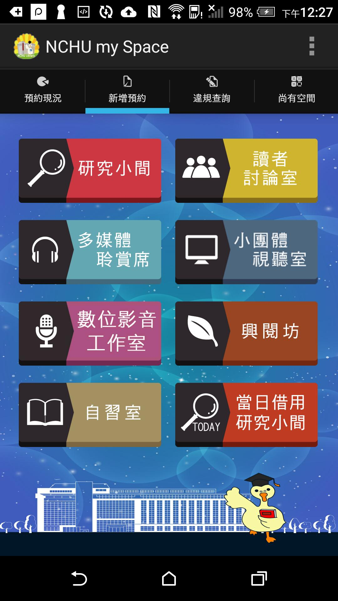
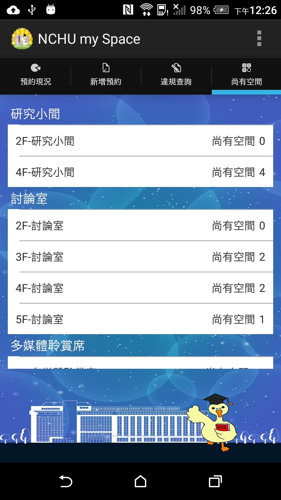
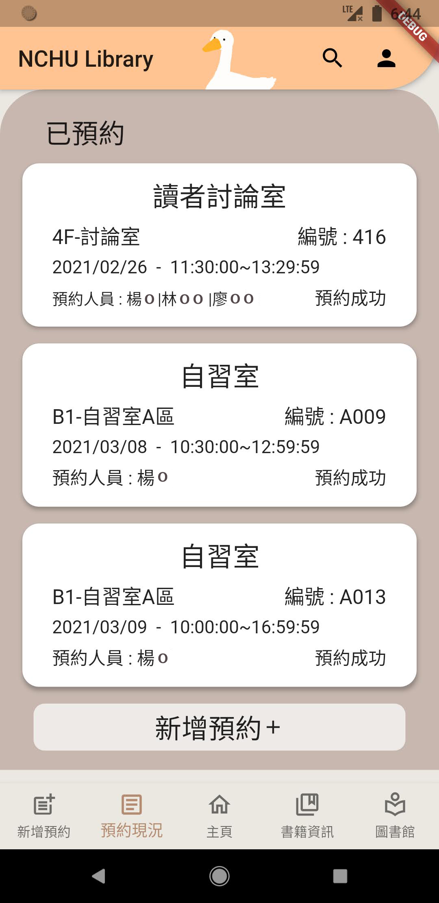
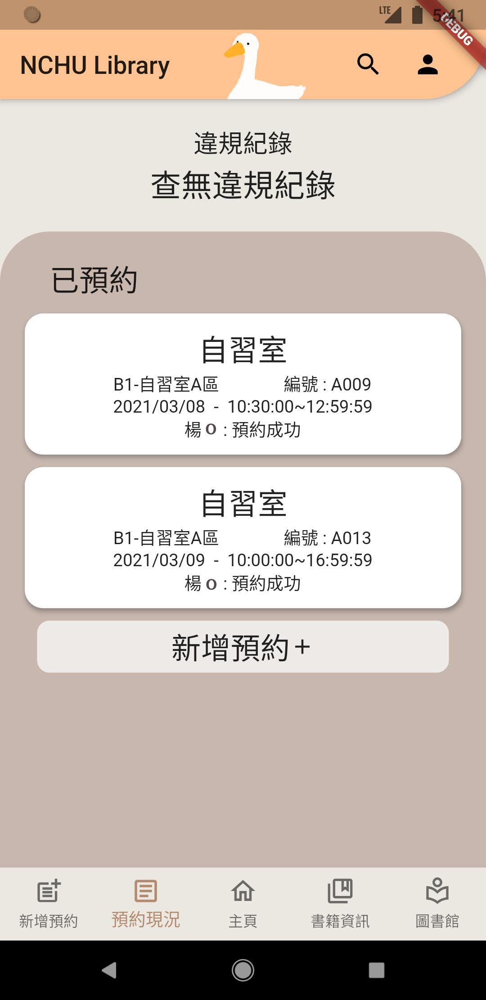
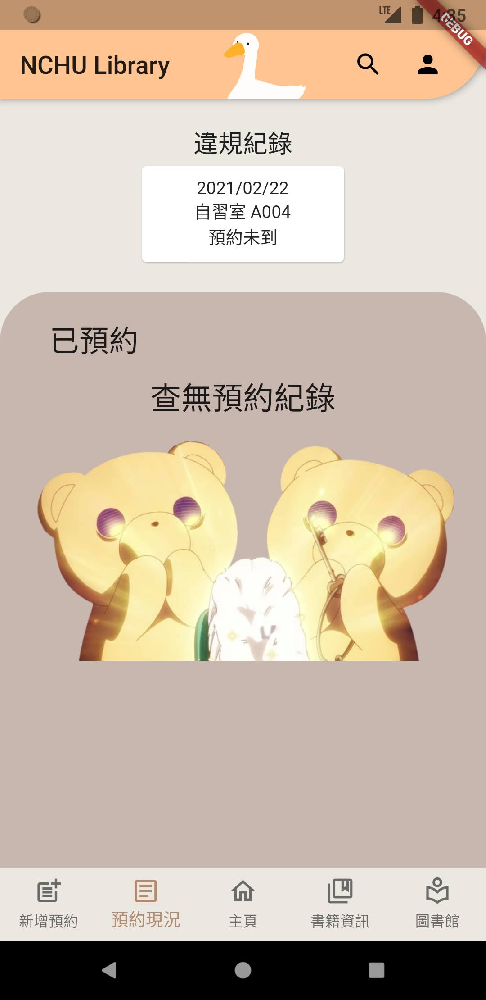
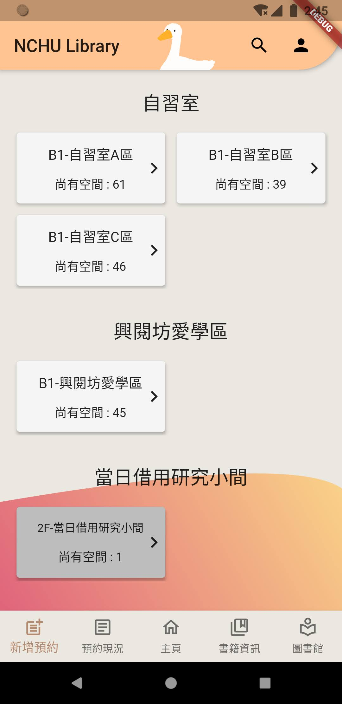

# NCHU_Library_APP

## 2023 Update

因學校 API 已關閉，且本人已畢業，此專案終止。

## Introduction

因為忍受不了學校自習室預約 APP 又醜又難用，心血來潮重寫的。

最終目標是整合圖書館資訊及自習室預約兩功能。(兩者到目前為止都是分開的)

## Old version (Official version)

## New version Demo

https://user-images.githubusercontent.com/33981880/220855557-ca6cf595-2587-4453-b737-b086d3d29a3c.mp4

# 雜亂筆記區
## 常用參數 : 
print(MediaQuery.of(context).size.height);      // app 畫面高
print(MediaQuery.of(context).padding.top);      // 上方 Safe Area 高
print(kToolbarHeight);                          // 上方 AppBar 高
print(kBottomNavigationBarHeight);              // 下方 BottomNavigationBar 高
print(MediaQuery.of(context).padding.bottom);   // 下方 Safe Area 高

一頁高
MediaQuery.of(context).size.height
- kToolbarHeight - kBottomNavigationBarHeight
- MediaQuery.of(context).padding.top
- MediaQuery.of(context).padding.bottom

data.runTimeType : 找資料型態

overflow: TextOverflow.ellipsis,

* 若在Card中包Slidable ---> 如 Card(Slidable)，會導致滑動刪除時，字被滑動超出 card 。
    * 因此要把 card 移到 Slidable 裡面的 child。
* 此外Card預設 marain : 四邊皆為 4，
    * 要去更改，否則拉出來的 delete widget 會與資料欄有間隙
    
參考資料的啦
swipe-to-dismiss in Flutter : 
https://medium.com/flutter-community/an-in-depth-dive-into-implementing-swipe-to-dismiss-in-flutter-41b9007f1e0
Flutter 清單滑動選項添加 : 
https://ithelp.ithome.com.tw/articles/10218170

獲取長字串的一部分
str.substring(0,8); 

<!--
測試API範例格式
final String host = 'http://140.120.80.35/APPAPI/GetDemeritList.aspx?sid=1efc3c997d5dcf978a8a&authid=9a1fd4&restype=json';
List datas;
getData() async{
await http.get(host).then((response){
  datas = jsonDecode(response.body);
});
print(datas);
}

2021/02/23
sid 
4686c4ed451ed065043f
authid 
ff5962
-->
